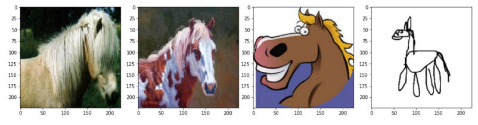
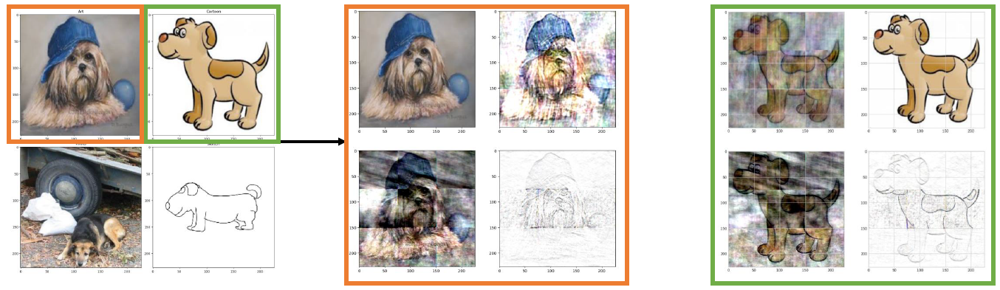
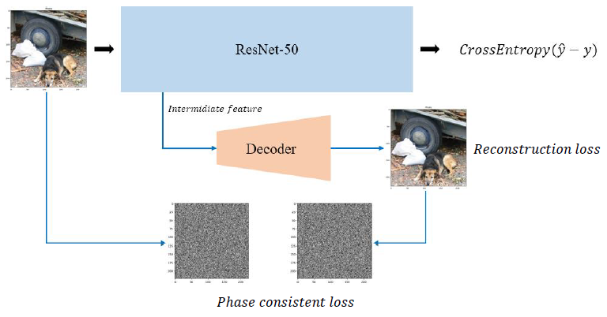

# PCDG

 Phase Consistency Domain Generalization
 
### Domain Shift 문제를 해결하기 위한 auxiliary layer를 추가한 아키텍처 제안

- Domain Shift Problem
 아래 사진과 같이 서로 분포가 다른 dataset에 대해서도 일관되고 강건한 예측 성능을 가지게 함
 

- Phase Consistent
아래 사진과 같이 이미지의 주파수 영역에서 상(phase)의 정보는 semantic한 정보를 가지고 있다는 것을 알 수 있음

- 본 연구에서 제안하는 최종 아키텍처와 각각의 손실값은 다음과 같음

